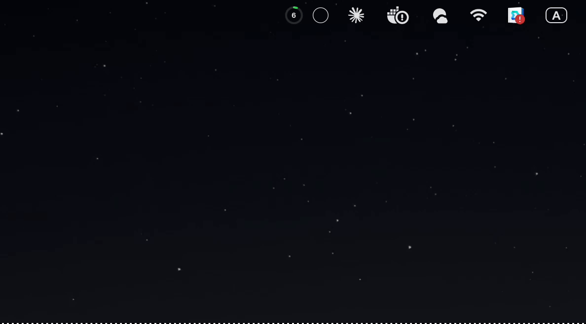
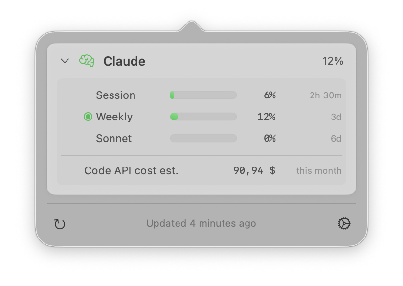
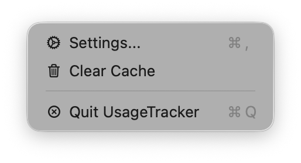
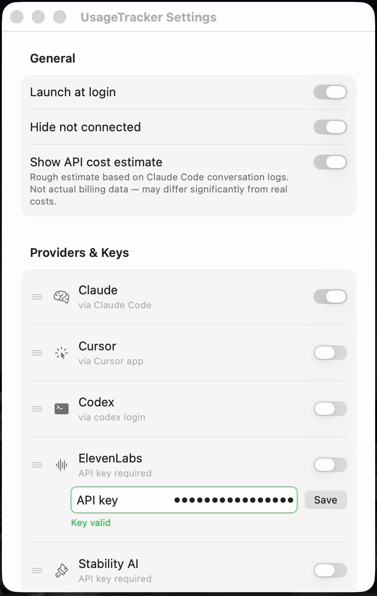

# UsageTracker

Track your AI service usage at a glance — Claude, Cursor, Codex, OpenAI, ElevenLabs, OpenRouter and more, right in your macOS menu bar.

### Popover — click the menu bar icon to see all your providers at a glance



| Popover | Settings |
|---------|----------|
|  |  |

### Settings — toggle providers, add API keys, drag to reorder



## Install

1. Download `UsageTracker.dmg` from [Releases](../../releases)
2. Open the DMG and drag UsageTracker to Applications
3. First launch: macOS may block an unsigned build — run this once in Terminal:
   ```bash
   xattr -cr ~/Applications/UsageTracker.app
   ```
   (Signed builds from GitHub Releases don't need this step.)
4. Launch UsageTracker from Applications

**Requirements:** macOS 13+, [Claude Code](https://claude.ai/code) installed and logged in

## What it shows

UsageTracker reads your usage data locally — no accounts, no telemetry.

| Provider | What's shown | How to connect |
|----------|-------------|----------------|
| **Claude** | Session %, Weekly %, Sonnet %, Opus %, extra credits, cost estimate, usage insights | Auto-detected (uses Claude Code login) |
| **Cursor** | Usage % | Auto-detected |
| **Codex** | Usage % | Auto-detected via `~/.codex/auth.json` |
| **OpenAI** | Monthly spend (admin key) or daily requests + tokens (project key) | Add key in Settings |
| **ElevenLabs** | Character quota % | Add key in Settings |
| **OpenRouter** | Credit balance or monthly spend | Add key in Settings |

## Usage

- **Left-click** the menu bar icon — open usage popover
- **Right-click** the menu bar icon — Settings, Refresh, Quit
- The icon color reflects your highest current usage (green → orange → red)
- Pin any metric to the menu bar via the dot indicator in the popover

## Settings

Settings live in `~/.usagetracker/`:
- `config.json` — refresh interval, provider order, visibility
- `openai.json`, `elevenlabs.json`, `openrouter.json` — API keys

## Build from source

```bash
git clone https://github.com/MrKaminskiy/UsageTracker
cd UsageTracker
make run
```

To run tests:
```bash
make test
```

## Known limitations

- **Password prompt on first launch**: UsageTracker reads Claude Code's stored login from your macOS Keychain. Click "Always Allow" once and you won't be asked again.
- **Runway and Stability**: Providers are implemented but not yet verified. They are hidden by default. You can enable them in Settings.
- **Cost estimate**: Reads `~/.claude/projects/*.jsonl` files. Accurate for Claude Code usage; does not include API usage outside Claude Code.
- **macOS 13+ required**: The app uses SwiftUI features not available on earlier versions.

## License

Released under the MIT License. See [LICENSE](LICENSE) for details.

